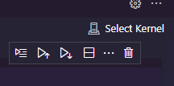
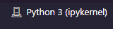

# Como rodar pyspark por um servidor remoto com acesso a um diretório local

Primeiramente, será necessário clonar o repositório em um diretório local. Para isso, abra o prompt de comando (Windows) ou terminal (Linux e Mac) e insira o seguinte comando:
```
git clone https://github.com/guipradow/pyspark_img_locally.git
```
<br>
</br>

Para rodar o pyspark a partir de um servidor remoto, você precisará instalar os seguintes programas:
- Docker-Desktop: https://www.docker.com/products/docker-desktop/   
- VS Code: https://code.visualstudio.com/
<br>
</br>

Com Docker-Desktop e VS Code instalados, execute o Docker-Desktop, e então, no prompt de comando (Windows) ou terminal (Linux e Mac) insira os seguintes comandos para baixar a imagem e buildar o container docker, respectivamente: 
```
docker pull jupyter/pyspark-notebook:spark-3.3.2
```

```
docker run -p 8888:8888 -v caminho/para/seu/diretorio:/home/jovyan/work jupyter/pyspark-notebook:spark-3.3.2
```
Substitua caminho/para/seu/diretorio pelo caminho do repositório que você clonou anteriormente. Por exemplo: c:/workspace/pyspark_img_locally.
<br>
</br>

No prompt, copie toda a URL do servidor: `http://127.0.0.1:8888/lab?token=seu-token`

Abra o VS Code no mesmo diretório do repositório. Você pode abrir o prompt de comando (Windows) ou terminal (Linux e Mac) e digitar o comando:
```
code .
```
<br>
</br>
Dentro do VS Code abra o arquivo example.ipynb dentro do diretório notebook, clique no kernel picker e selecione a opção *existing jupyter servers*, cole a URL copiada anteriormente e pressione a tecla enter.
<br>
</br>

<br>
</br>
Seguindo os passo a passo corretamente, você estará rodando o seguinte kernel:
<br>
</br>

<br>
</br>
A partir daí você está apto a rodar pyspark por um servidor remoto com acesso a um diretório local. Execute o ipynb para testar.
